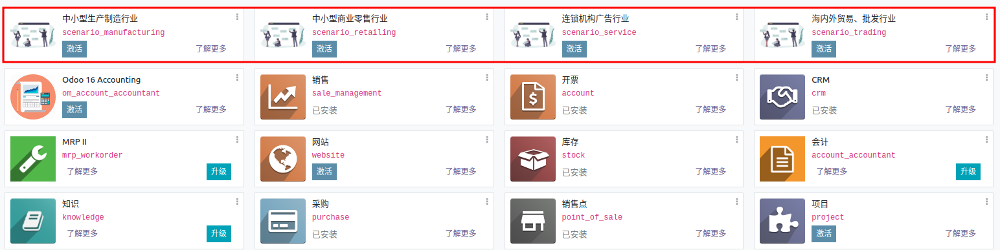
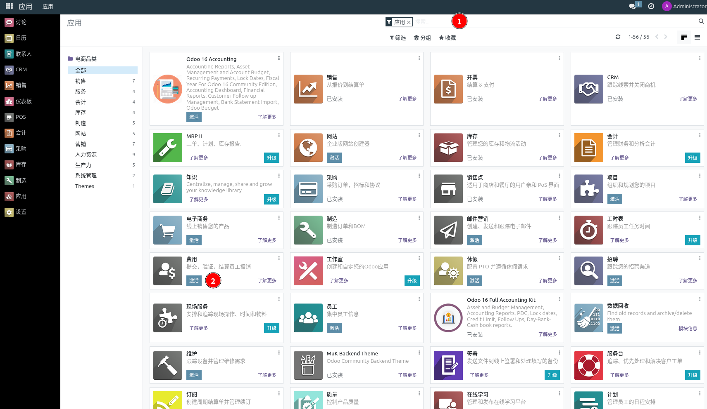

# 模块安装

::: danger
初次登录务必修改初始密码，设置10位以上包含大小写字母和数字的强安全密码，在任何情况下不要泄露给他人；同时务必保证邮箱的正确（找回密码等都需要邮箱）
:::

点击 应用 菜单，进入应用页面，搜索想要安装的模块，找到相应模块之后，点击 激活 完成安装。

::: danger
非必须模块请不要安装，已经安装的模块请不要轻易卸载，否则会导致系统数据丢失！！！！切记！！！
:::

