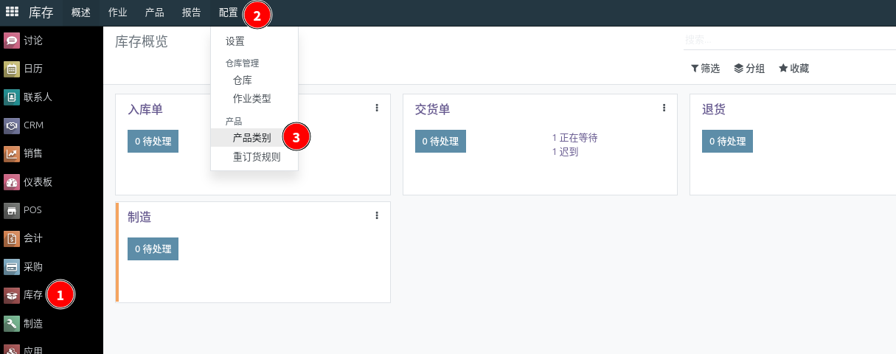
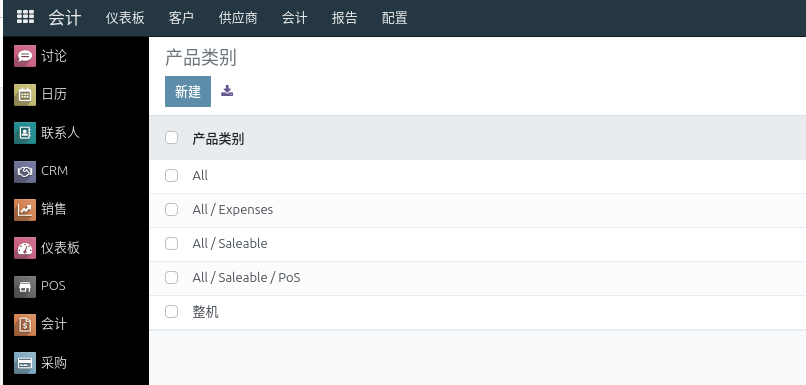
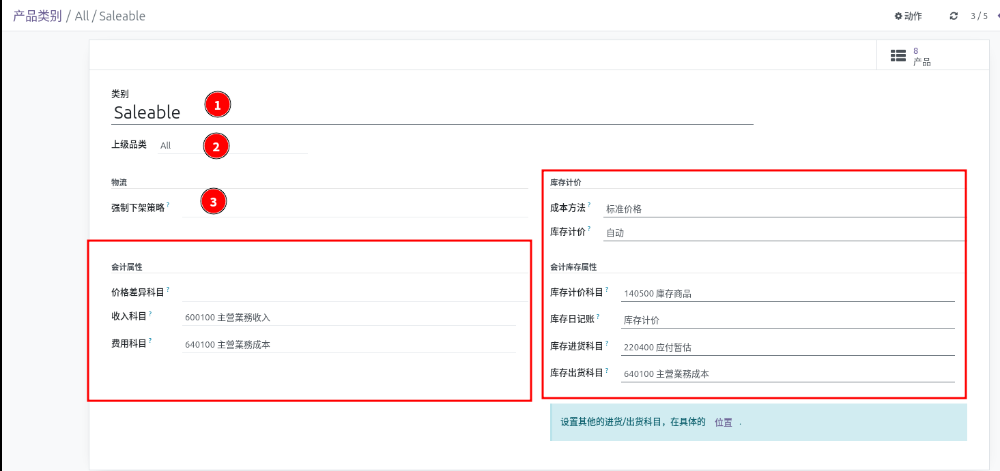
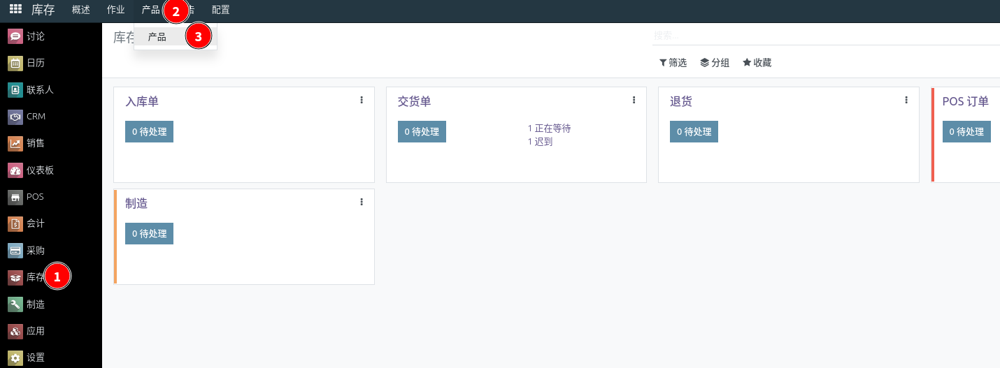
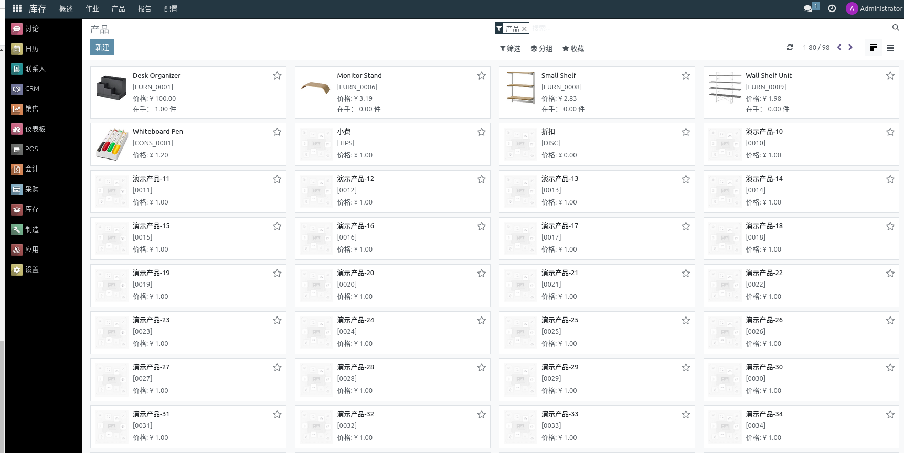
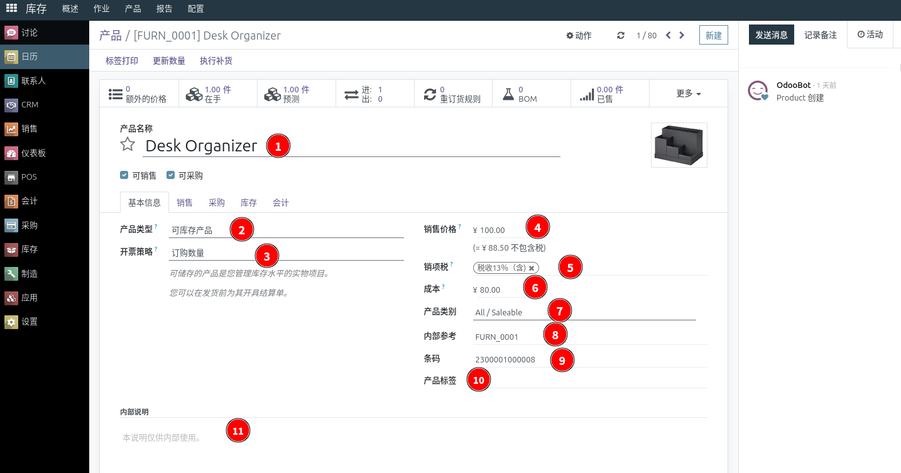
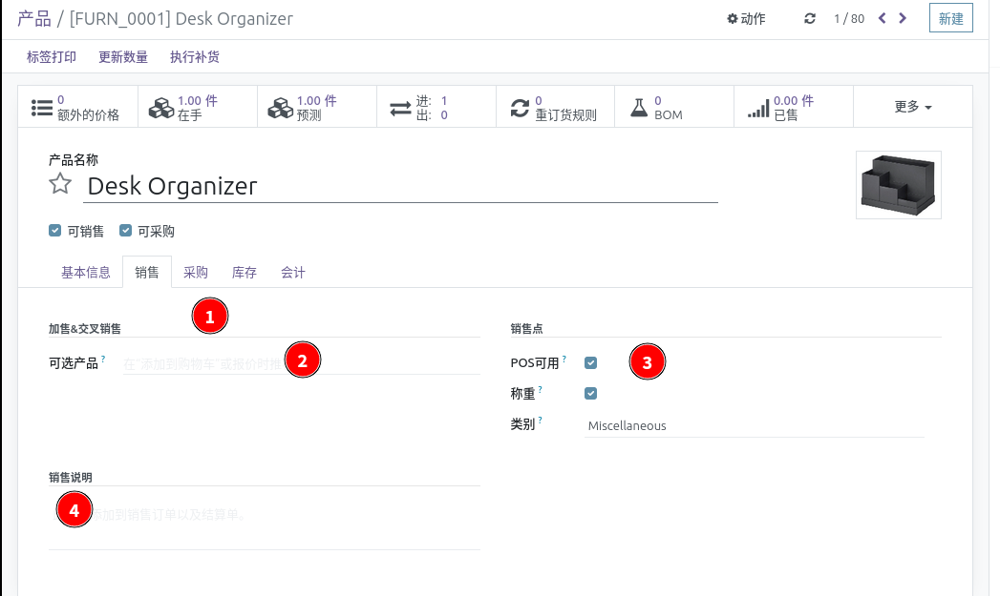
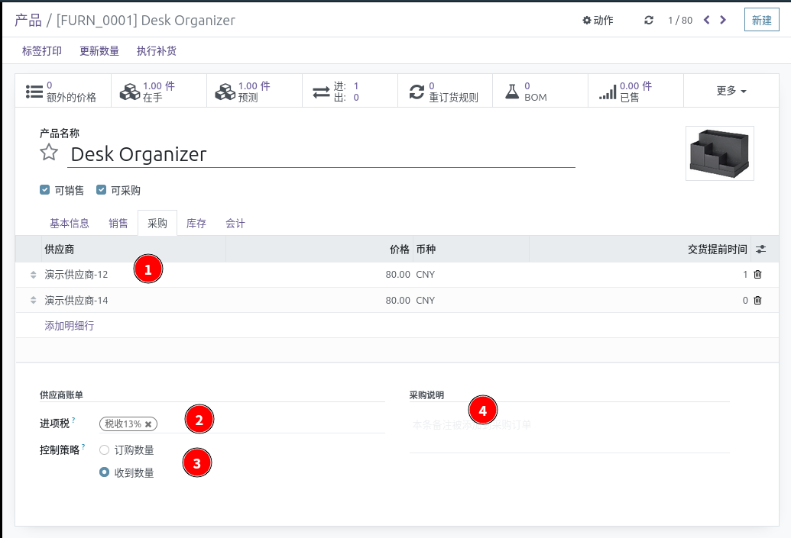
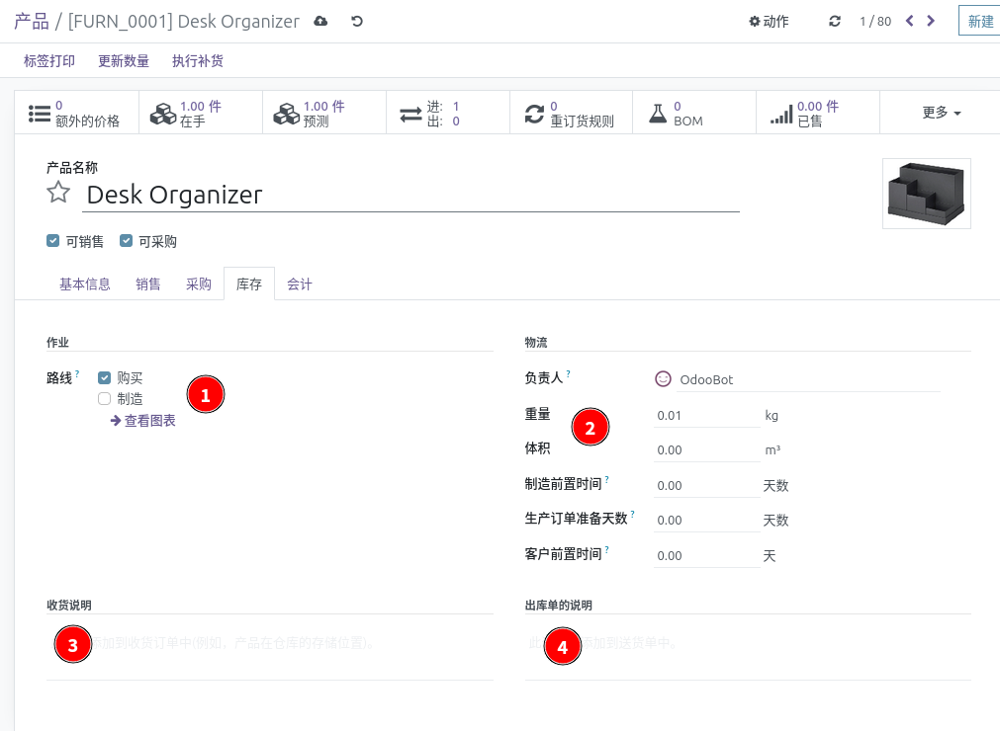
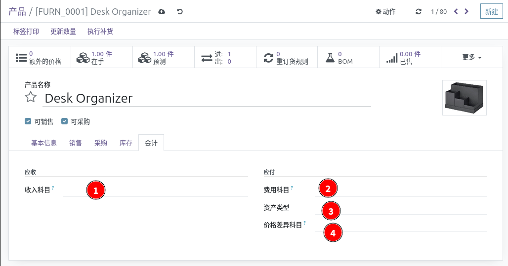

# 产品设置

::: danger
初次登录务必修改初始密码，设置10位以上包含大小写字母和数字的强安全密码，在任何情况下不要泄露给他人；同时务必保证邮箱的正确（找回密码等都需要邮箱）
:::

前提条件：已经安装 **库存** 或者 **采购** 或者 **销售** 模块

知识要求：具备基本的计算机操作知识

系统权限：系统管理员 或者 库存经理  或者 采购经理 或者 销售经理

## 产品类别

点击进入产品类别列表

查看设置自己的产品类别，点击创建可以添加新的类别，点击具体类别可以调整类别

填写类别名称、选择上级类别、设置强制下架策略：先进先出、后进先出、最近库位

会计科目部分参考这里：[会计设置](accounting-settings.md) 产品类别部分

::: danger
产品类别整体设置完成之后，请勿轻易修改设置，除非必要或者设置有误。
:::

## 产品设置

点击进入产品看板页面

浏览产品信息，点击创建按钮创建新的产品

### 基本信息

1. 产品名称：产品简要的描述，不必很长，能够区分不同产品即可
2. 产品类型：有三个选项
   * 库存产品：需要库存管理，记录库存价值
   * 低值易耗：库存管理数量，成本进入当期会计区间
   * 服务：无需库存管理
3. 开票策略：有两个选项
   * 订购数量：按照订购数量给客户开票，服务类型的产品通常使用这个选项
   * 交付数量：按照交付给客户的数量向客户开票，库存类型的产品通常使用这个选项
4. 销售价格：销售给客户的常规价格
5. 销项税：按照企业类型选择实际税率
6. 成本：
   * 在标准价格和 AVCO 中：产品的价值（在 AVCO 中自动计算）。
   * 在 FIFO 中：将离开库存的下一个单位的值（自动计算）。
   * 用于在购买成本未知时对产品进行估价（例如库存调整）。
   * 用于计算销售订单的利润。
7. 产品类别：选择对应的产品类别，一个产品只能属于一个类别
8. 内部参考：就是产品编码
9. 条码：产品的条形码，出入库、POS场景可以用终端扫描
10. 产品标签：产品的标记，便于产品的查询
11. 内部说明：产品的详细描述

### 销售设置 

### 采购设置

### 库存设置

### 会计设置

这些科目通常留空，取产品类别上面的科目设置；或者设置不同于类别的科目

