# 销售设置

::: danger
初次登录务必修改初始密码，设置10位以上包含大小写字母和数字的强安全密码，在任何情况下不要泄露给他人；同时务必保证邮箱的正确（找回密码等都需要邮箱）
:::

前提条件：已经安装 **销售** 模块

知识要求：具备基本的计算机操作知识，以及销售管理基础知识

系统权限：系统管理员 或者 销售经理

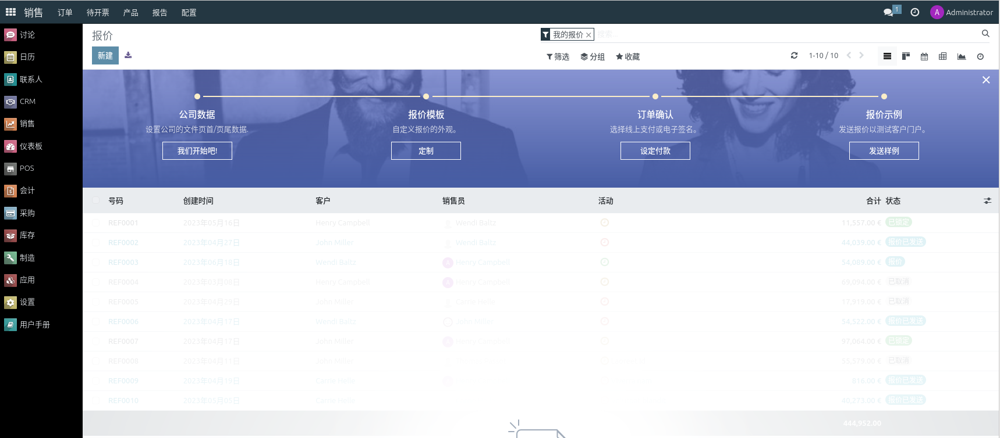

## 基础设置
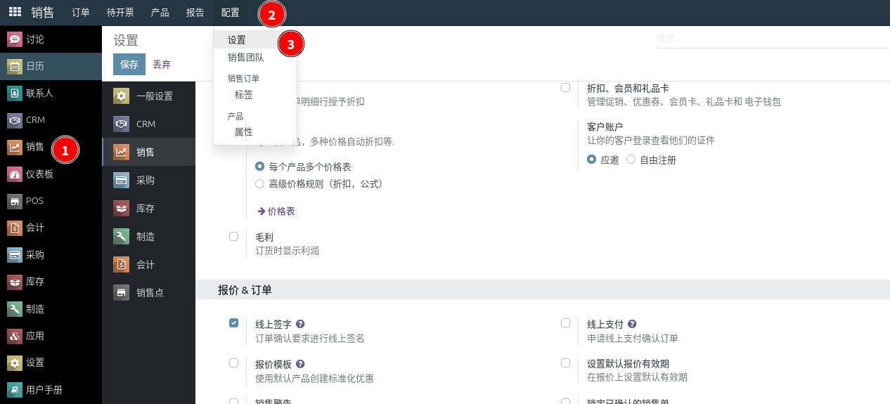

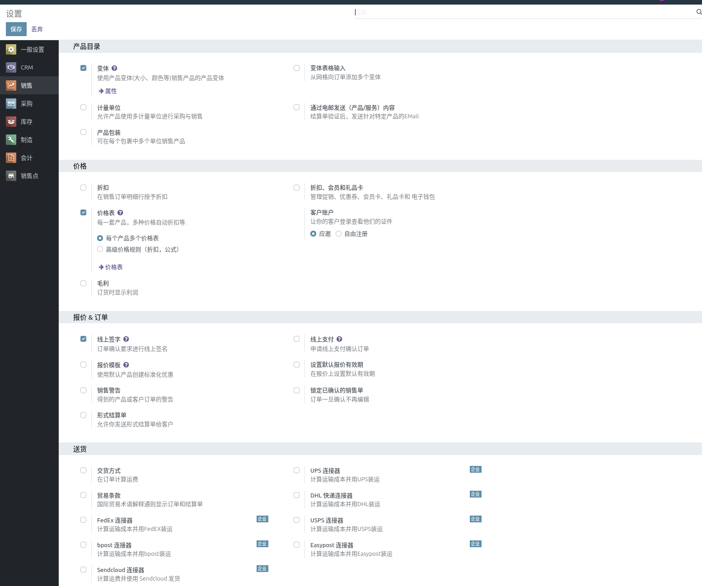

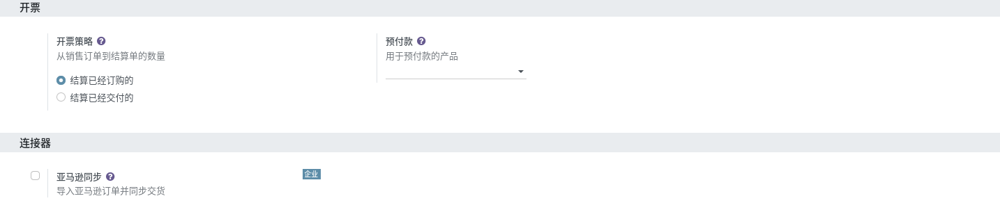

## 销售团队
可以设置多个销售团队，细化销售管理

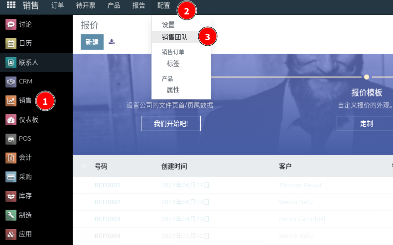

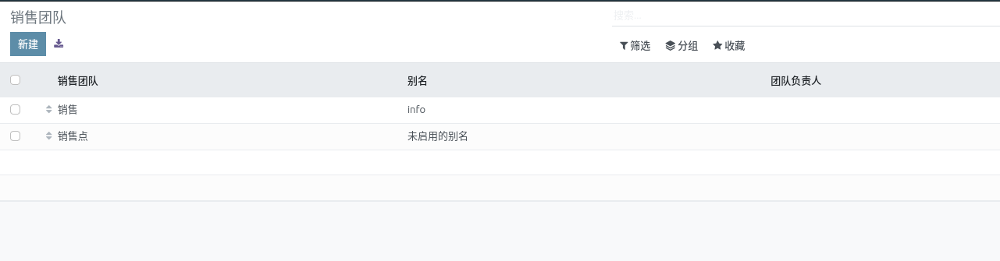

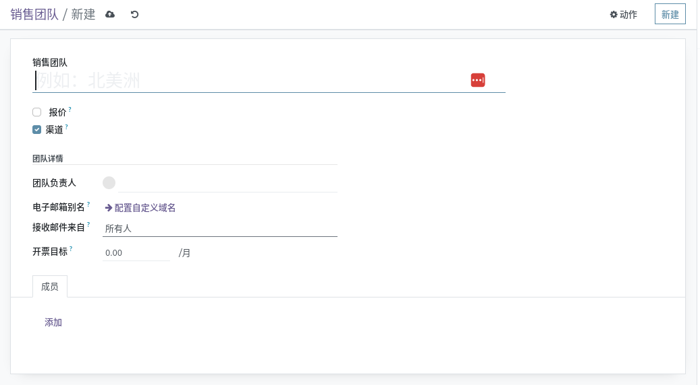

## 销售价格
产品销售价格管理，可以设置不同价格表以满足不同的销售场景。

路径：销售/产品/价格表

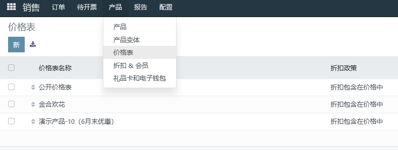

更新或者新建价格表

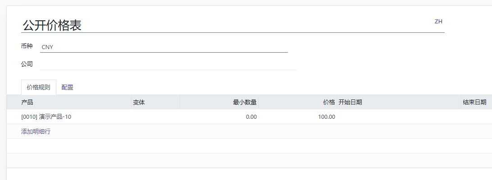

输入价格表名称，选择币种、公司，价格规则填入产品、变体、最小数量、单价、开始日期、结束日期

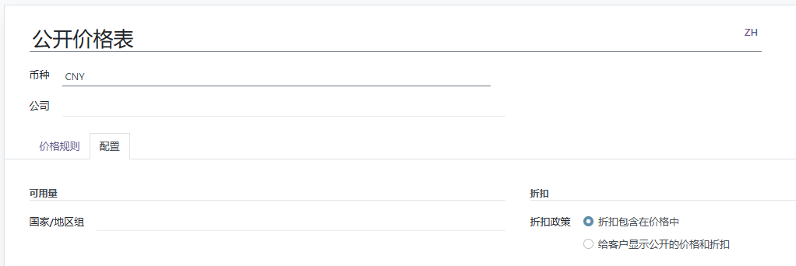

配置选择国家/地区，折扣政策，完成后手动保存

## 促销设置

### 会员折扣
路径：销售/产品/折扣&会员

点击新建，建立折扣方案

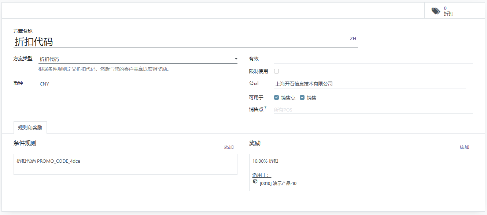

输入折扣名称，选择方案类型、币种、产品折扣等，完成后手动保存

### 充值卡券
路径：销售/产品/礼品卡和电子钱包

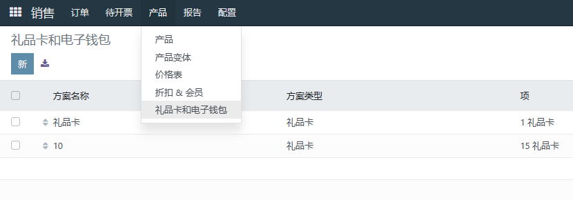

点击新建，建立礼品卡和电子钱包

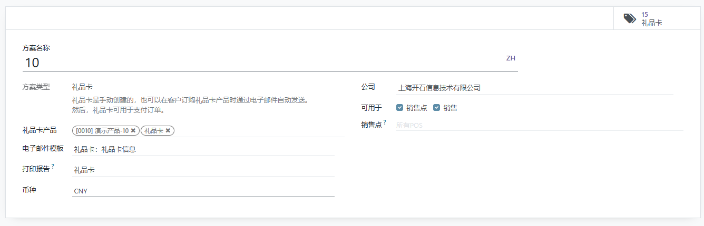

填入并选择方案信息

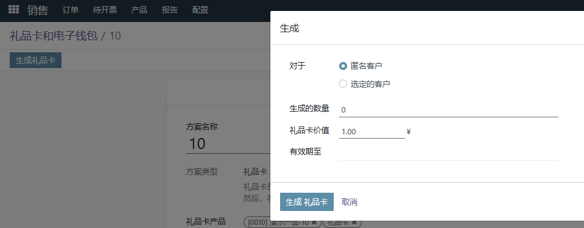

点击生成礼品卡，选择客户、生成数量、价值、有效期，点击生成，可发送给客户