# 用户管理

::: danger
初次登录务必修改初始密码，设置10位以上包含大小写字母和数字的强安全密码，在任何情况下不要泄露给他人；同时务必保证邮箱的正确（找回密码等都需要邮箱）
:::

前提条件：无；建议安装相应的模块之后，再进行设置

知识要求：了解基本系统权限设置原理

系统权限：系统管理员

## 用户管理
添加新用户、维护用户基本信息、分配系统权限、设置密码等。

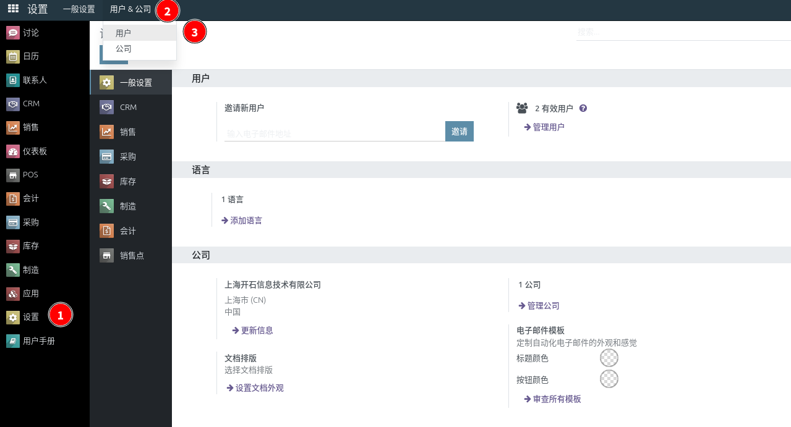

点击进去用户列表页面

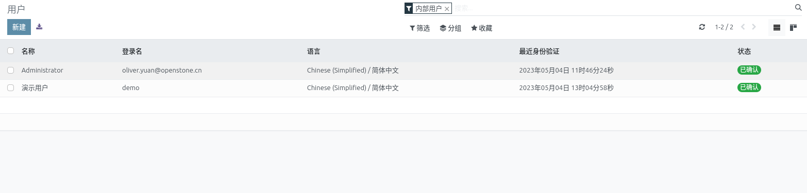

选择更新用户或者添加用户

### 访问权限

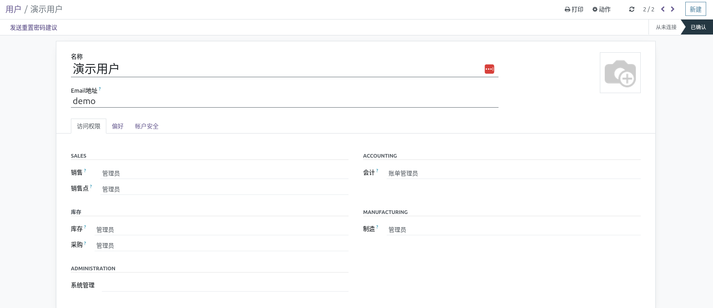

选择要分配给用户的权限

### 偏好

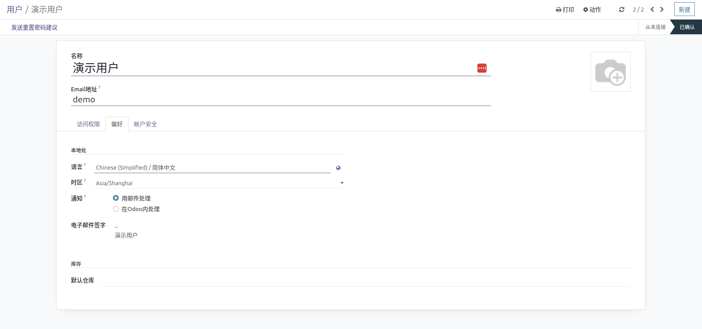

### 账户安全

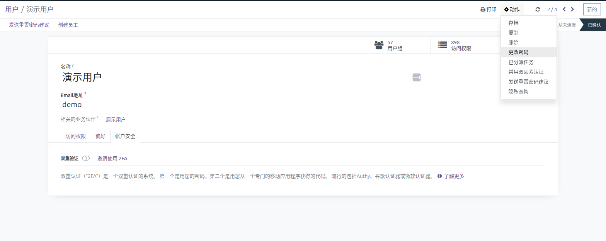

点击顶部的动作，可以设置密码

## 用户权限

进入开发者模式（操作参考：[技术设置](technical-settings.md) ），就可以看到这个菜单

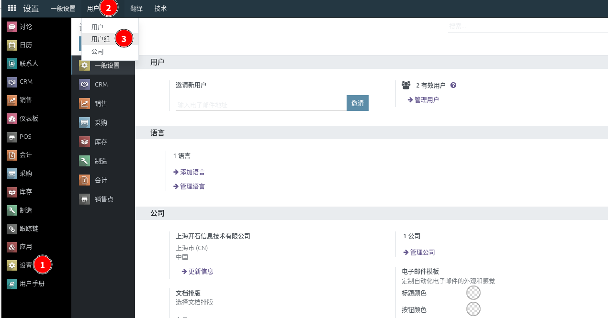

用户组是用户的具体权限，通过用户组控制菜单、视图、模型访问、记录访问

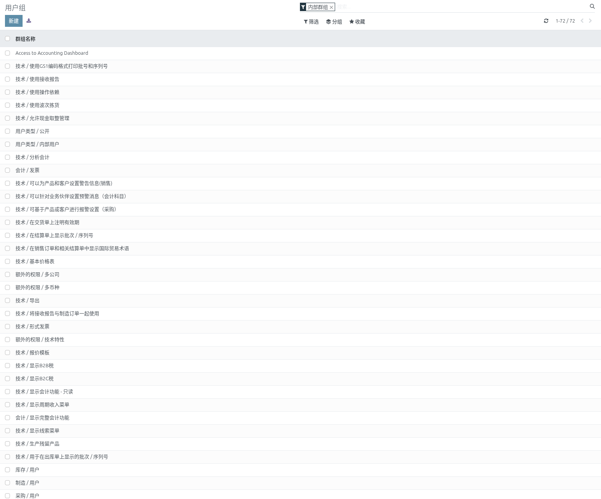

### 用户

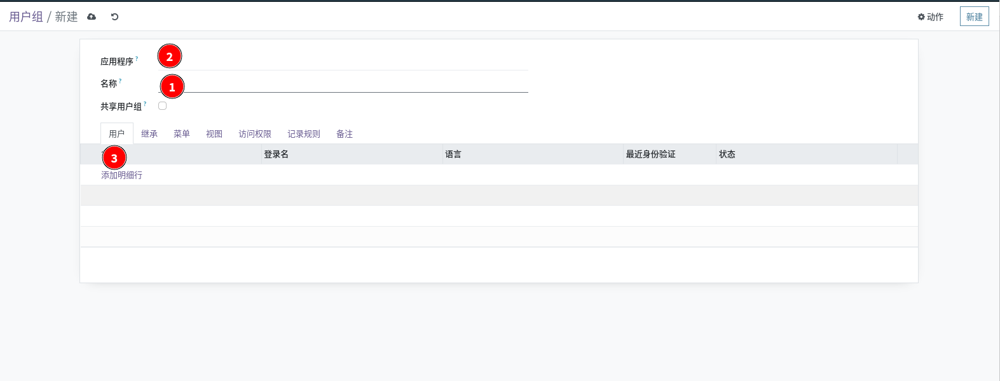

选择用户组所属的应用，输入用户组名称，选择哪些用户有这个权限

### 继承
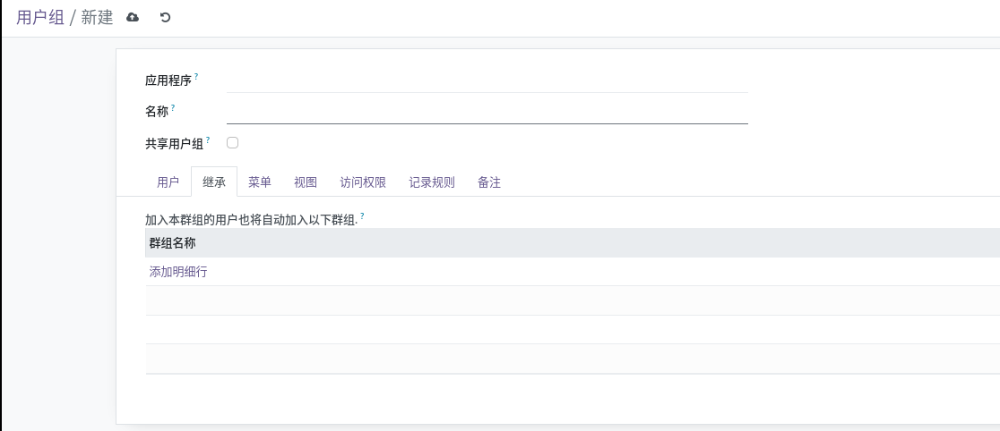

选择需要继承的用户组，继承意味着用户只要有这个权限，就会自动继承这个用户组的权限
### 菜单

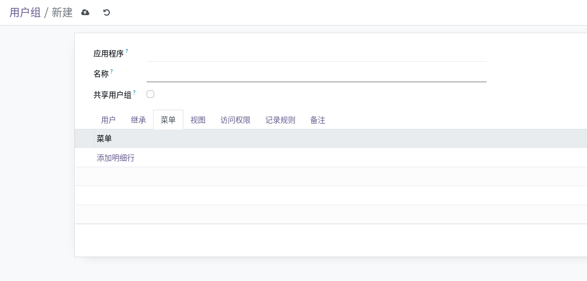

选择可以访问的菜单，通常不要维护，由模型访问权限控制
### 视图

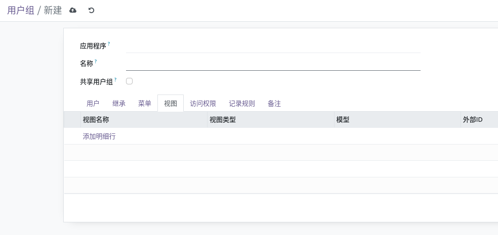

选择可以访问的视图，通常不需要维护，由模型访问权限控制
### 访问权限
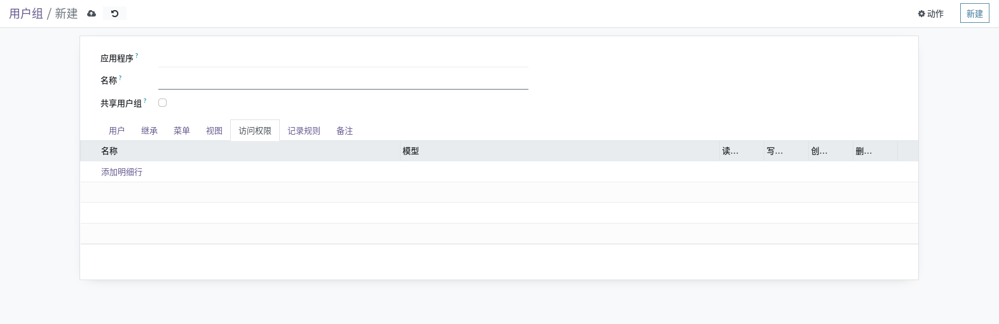

添加需要访问的数据模型，设置读取、写入、删除、创建的具体访问控制
### 记录规则

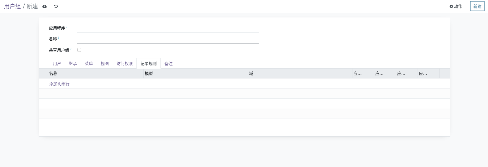

设置数据集的访问规则就是记录规则设置

