# 库存设置

::: danger
初次登录务必修改初始密码，设置10位以上包含大小写字母和数字的强安全密码，在任何情况下不要泄露给他人；同时务必保证邮箱的正确（找回密码等都需要邮箱）
:::

前提条件：已经安装 **库存** 模块

知识要求：具备基本的计算机操作知识，以及仓库管理基础知识

系统权限：系统管理员 或者 库存经理

## 基础设置
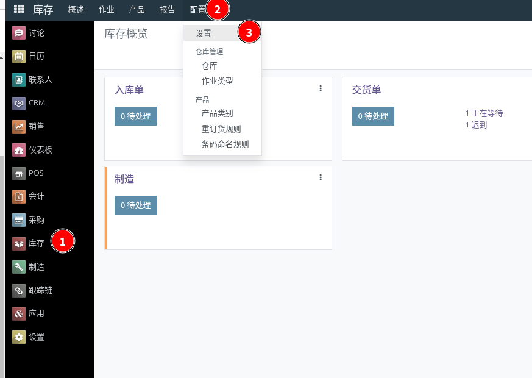

点击进入基础设置页面，根据需要启用相关的设置

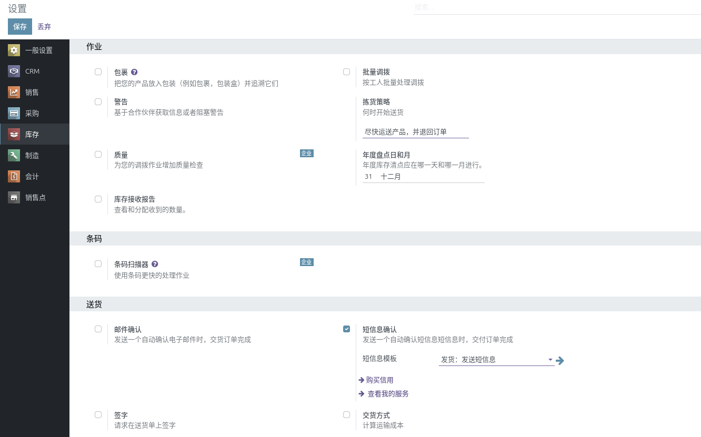

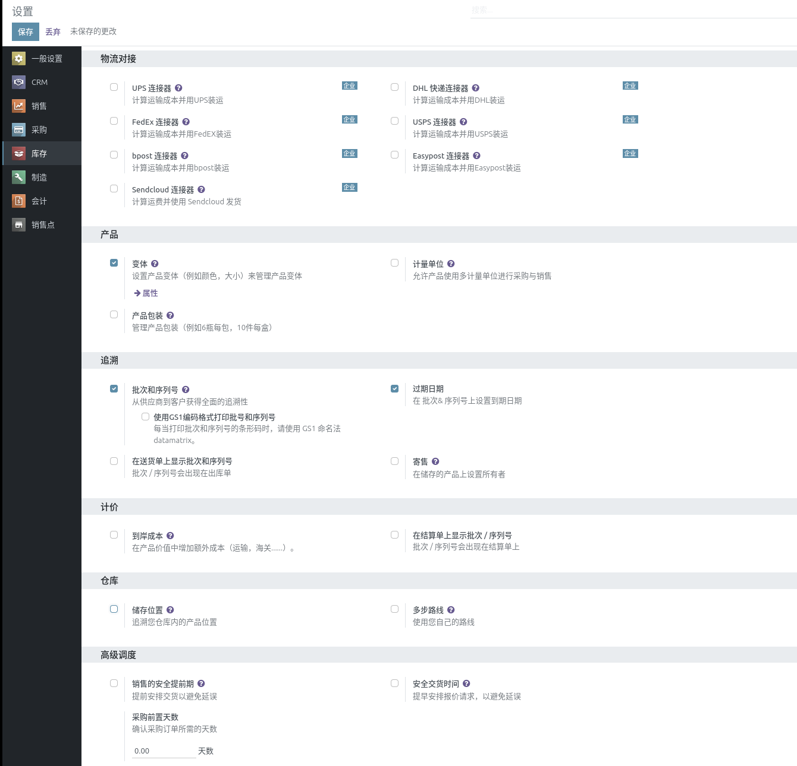

## 仓库设置
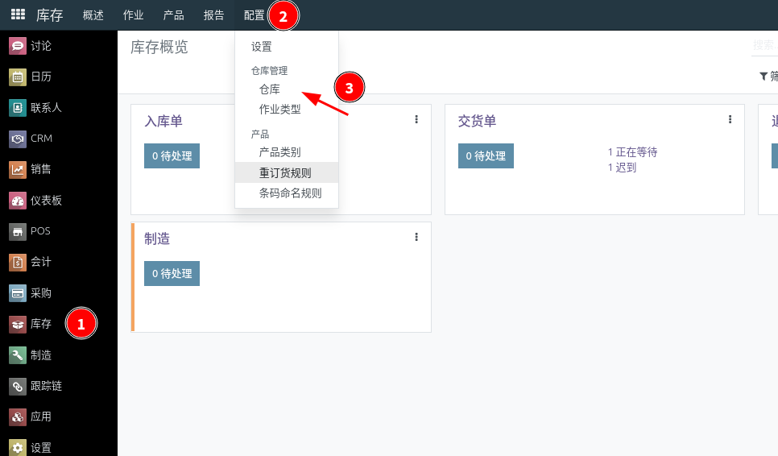

仓库是库存管理的重要地点，系统支持多仓库设置。点击进入仓库列表页面

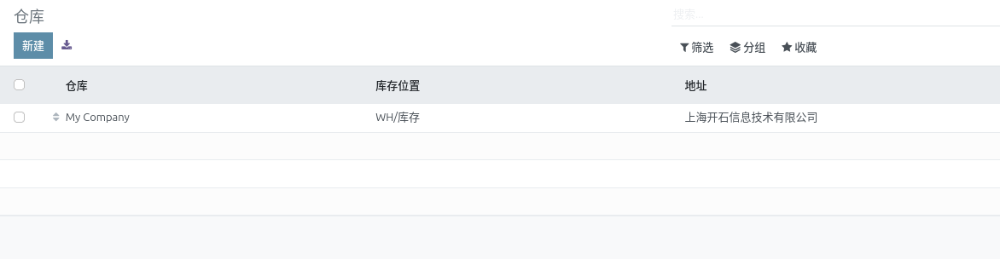

点击相应条目，进入仓库管理页面；如果企业物理上存在多个仓库，建议创建相应的仓库

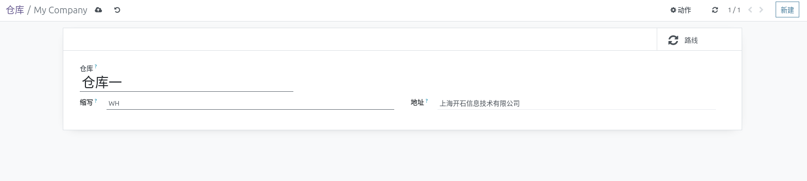

新建仓库

添加新的仓库之后，库存主页面也相应变成下面这样

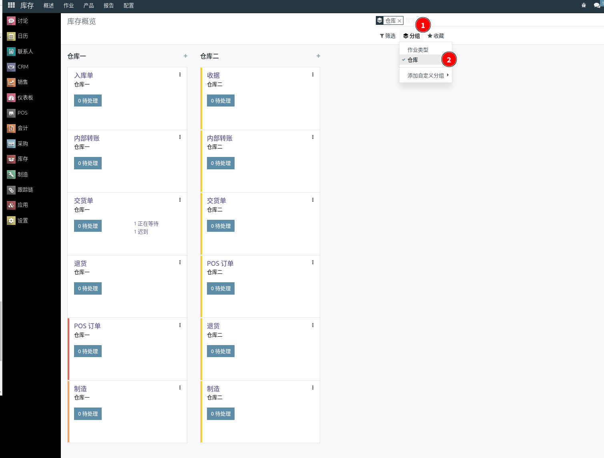

点击分组，选择仓库，操作界面就会按照仓库分组显示作业单据

## 库存位置
前提条件：在上面基础设置中，启用 仓储位置 设置

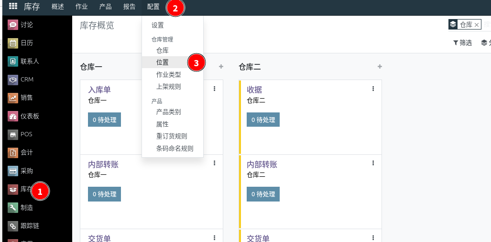

点击进入仓库位置列表页面

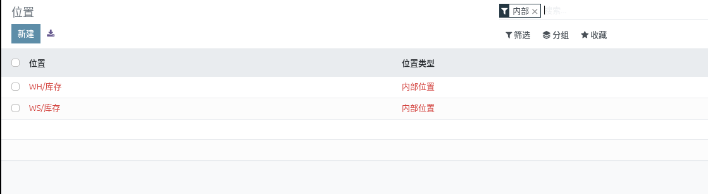

可以按照仓库的区域或者货架设置相应的库位，比如，WH/库存/A1/01-01 这样的库位层级代表A1货架的第1层第1个格子。

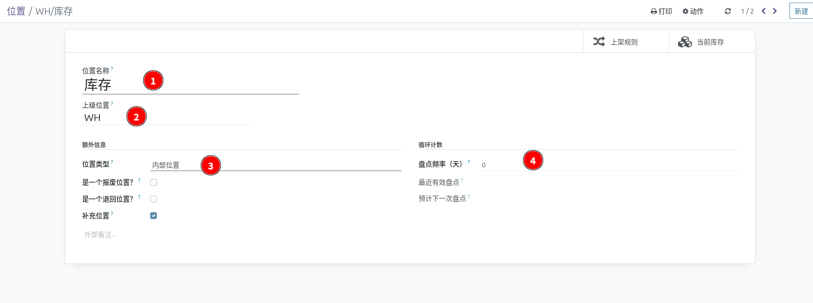

填写库位名称，选择上级库位，选择位置类型，设置盘点频率，如果需要。
1. 位置类型：有7个选项
   * 供应商位置：虚拟位置，表示来自供应商的产品的源位置。
   * 视图：虚拟位置，用于为仓库创建层次结构，聚集其子位置; 其本身不能存放库存产品。
   * 内部位置：您自己仓库内的物理位置。
   * 客户位置：虚拟位置，表示发送给客户的产品的目标位置。
   * 库存损失：虚拟位置作为库存作业的对应物，用于纠正库存水平（物理库存）。
   * 生产：生产作业的虚拟对应位置：此位置消耗组件并生产成品。
   * 中转站：应在公司间或仓库间运营中使用的对应地点。
2. 盘点频率：按照设置的时间间隔，自动生成盘点单。

::: danger
仓库库位整体设置完成之后，请勿轻易修改库位名称，也不要轻易调整库位结构，否则库位错乱！！！
:::
   
## 上架规则
上架规则对于多库位的仓库极为重要，设置了上架规则，产品入库，系统可以指导将产品放置到哪个库位。

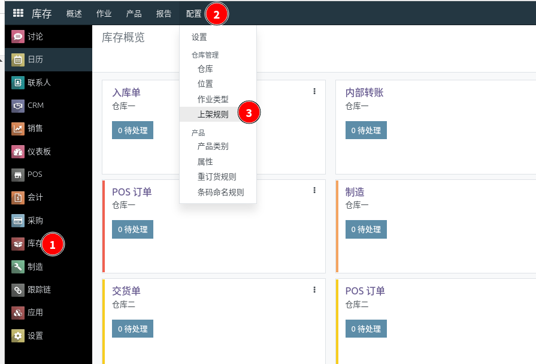

点击进入上架规则页面

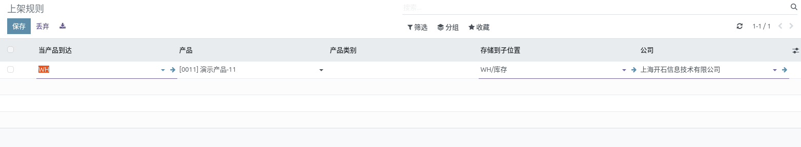

创建新的规则：当某产品到达某库位后，触发上架规则，在入库单生成实际的目的库位

## 产品类别
参考：[产品设置](product-settings.md#产品设置-1) 的 产品类别 部分

## 安全库存
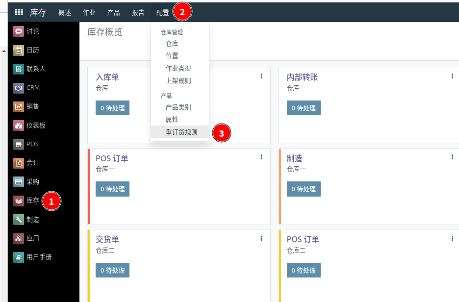

通过重订货规则可以设置某个库位某个产品的最大最小库存，当这个产品低于这个最小库存的时候，系统触发补货，补货到设置的最大库存数量。点击进入重订货规则页面。

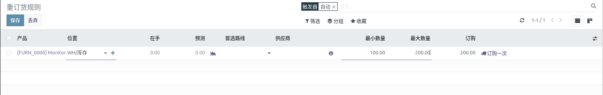

设置重订货规则

## 作业类型
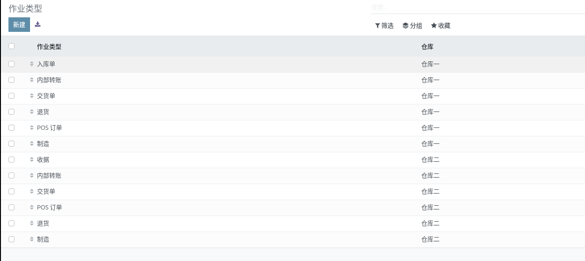

通常不需要设置增加，如果需要精细化管理，可以创建添加新的作业类型

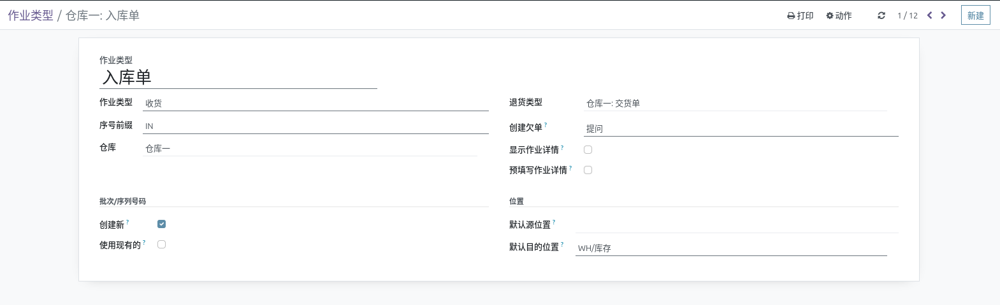

