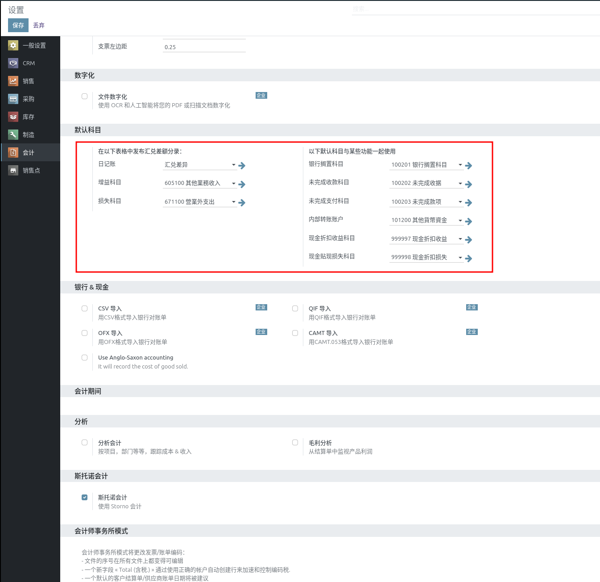

# 会计设置

::: danger
初次登录务必修改初始密码，设置10位以上包含大小写字母和数字的强安全密码，在任何情况下不要泄露给他人；同时务必保证邮箱的正确（找回密码等都需要邮箱）
:::

前提条件：已经安装 **开票** 和 **会计** 模块

知识要求：具备基本的财务知识，了解企业基本记账

系统权限：系统管理员 或者 财务经理 

## 会计科目

进入会计科目表

检查会计科目是否完备，如果需要添加新的科目，点击上面的 创建 按钮，添加新的科目

填写科目编码，科目名称，选择科目类型，然后点击 保存 按钮

## 银行账户

点击会弹出银行账户输入页面，见下面截屏

输入科目编码、选择银行，然后点击 创建 按钮创建记录

进入科目表可以看到刚添加的银行科目

## 付款条件

点击进入付款条件列表，付款条件会作用到具体结算单的到期日期

查看系统内置的付款条件，如果不够，可以点击 创建 按钮，添加新的付款条件

输入名称，以及条件设置，然后保存(点击3上面的图标)

## 产品类别

进入产品类别列表页面

点击具体类别，设置相应的科目，按照产品形态以及核算要求设置不同的类别

1. 成本方法：有三种方式
   * 标准价格：按照产品上定义的标准成本对库存产品进行计价
   * 平均成本：以加权平成本对库存产品进行计价
   * 先进先出：按照每个入库批次的实际成本进行计价，出库时按入库先后计入成本
2. 库存计价：有两种方式
   * 手动：库存计价的会计凭证不会自动生成，需要手工建凭证
   * 自动：库存产品出入库的时候，会按照上面设置的成本方法自动生成相应的凭证
3. 收入科目：主营业务收入科目，一般使用默认设置
4. 费用科目：
   * 费用物品类别：主营业务成本科目，费用物品类别的采购出账单会用到
   * 库存物品类别：应收暂估科目，库存物品类别采购出账单会用到
5. 库存日记账：库存计价使用的日记账，一般使用默认设置
6. 库存计价科目：记录库存价值的科目，一般会使用库存商品科目，视产品具体类别而定
7. 库存进货科目：产品入库时候的贷方科目，一般为应付暂估科目
8. 库存出货科目：产品出库时候的借方科目，一般为主营业务成本科目

产品类别科目的一般设置

## 基础设置

点击进入会计基础设置

一般采用默认设置，不需要调整

