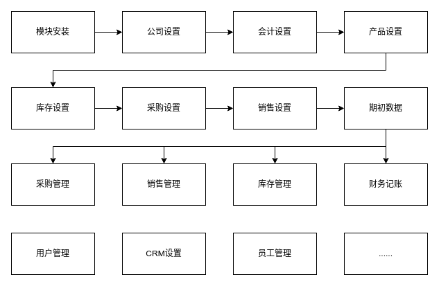

# 连锁机构、广告行业环境设置

::: danger
初次登录务必修改初始密码，设置10位以上包含大小写字母和数字的强安全密码，在任何情况下不要泄露给他人；同时务必保证邮箱的正确（找回密码等都需要邮箱）
:::

::: info
中小型商业零售行业通常需要有销售、采购、库存、POS、往来记账的管理，其次内部员工管理等。
:::

::: info
建议使用最新的火狐或者谷歌浏览器访问您收到的系统地址。
:::

::: info
练习环境：https://qyerp.saas.openstone.cn 账号：demo 密码：demo
:::

## 模块安装

| 模块名称 | 模块描述                          | 安装说明 |
|------|-------------------------------|------|
| 销售   | 销售                            | 核心   |
| 采购   | 	采购                           | 	核心  |
| 库存   | 	库存	                          | 核心   |
| 开票   | 	开票	                          | 核心   |
| 会计   | 	Odoo 16 Full Accounting Kit	 | 可选   |
| 界面   | 	MuK Backend Theme            | 	可选  |

用管理员账号登录系统，点击 **应用** 菜单，进入模块列表，激活上述模块。

具体操作步骤：[模块安装](module-installation.md)

或者直接激活对应的行业场景，一键完成安装！

:::danger
非必须模块请不要随意安装，已经安装的模块请不要轻易卸载，否则会导致系统数据丢失，甚至环境不可用！！！！切记！！！切记！！！切记！！！！
:::

## 公司设置
   用管理员账号登录系统，点击 **设置** 菜单，进入设置页面

   具体操作步骤：[公司设置](company-settings.md)
## 会计设置
   用管理员账号登录系统，点击 会计 菜单，进入设置页面

   具体操作步骤：[会计设置](accounting-settings.md)
## 产品设置
   用管理员账号登录系统，点击 **库存 / 产品 / 产品** 菜单，进入设置页面

   具体操作步骤：[产品设置](purchase-settings.md)
## 库存设置
   用管理员账号登录系统，点击 **库存**  菜单，进入设置页面

   具体操作步骤：[库存设置](warehouse-settings.md)
## 采购设置
   用管理员账号登录系统，点击 **采购** 菜单，进入设置页面

   具体操作步骤：[采购设置](purchase-settings.md)
## 销售设置
   用管理员账号登录系统，点击 **销售** 菜单，进入设置页面

   具体操作步骤：[销售设置](sales-settings.md)
## 期初数据
   对于已经存在的业务数据的处理，主要涉及：当前库存、未结采购、未结销售、应付账款、应收账款、期初余额

   具体操作步骤：[期初数据](balance-settings.md)
   
::: info
祝贺您！至此，您已经完成系统的基本配置，可以添加用户，开展业务了！！！
:::

## 添加用户
   参考文档：[用户管理](user-management.md)
## 开展业务
1. [销售订单](sales-order.md) --》 [销售出库](sales-deliver.md)  --》[销售账单](sales-bill.md)  --》[销售收款](sales-payment.md)
2. [采购订单](purchase-settings.md) --》 [采购入库](purchase-receipt.md)  --》[采购账单](purchase-bill.md)  --》[采购付款](purchase-payment.md)
3. 仓库盘点 [库存盘点](stock-inventory.md)
4. 财务总账 [会计凭证](accounting-voucher.md)
5. 财务报表 [财务报表](financial-reporting.md) 
