# POS设置

::: danger
初次登录务必修改初始密码，设置10位以上包含大小写字母和数字的强安全密码，在任何情况下不要泄露给他人；同时务必保证邮箱的正确（找回密码等都需要邮箱）
:::

前提条件：已经安装 **POS** 模块

知识要求：具备基本的计算机操作知识，以及POS基础知识

系统权限：系统管理员 或者 POS经理

## 基础设置

维护或者添加销售点，以及每个销售点的基础设置

路径：POS/配置/设置

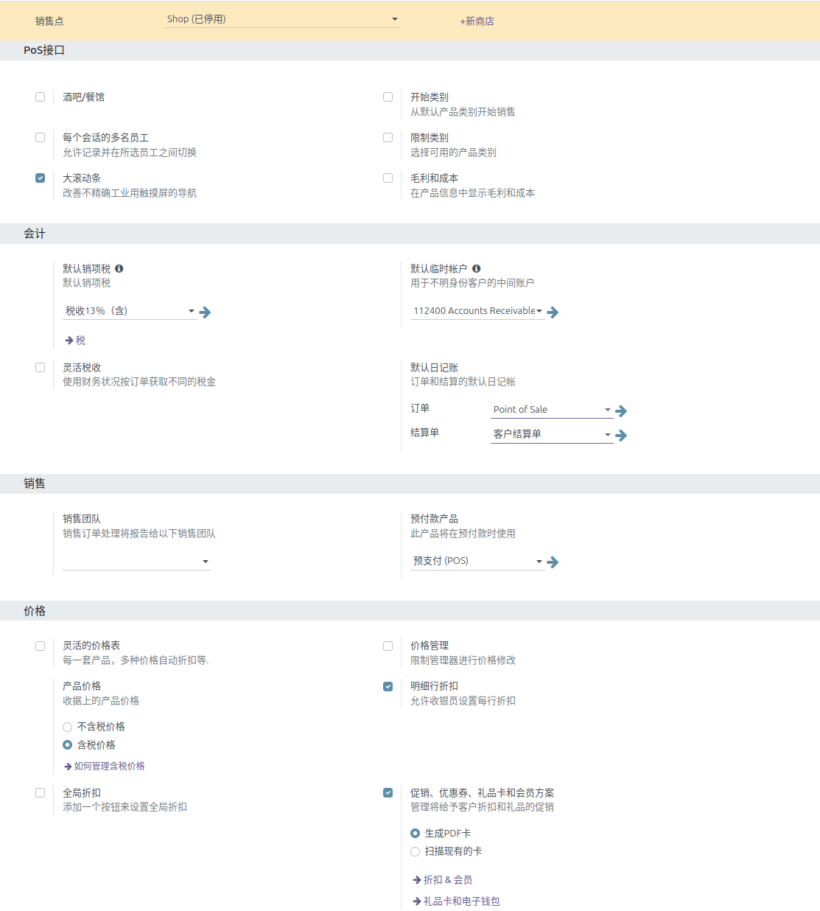

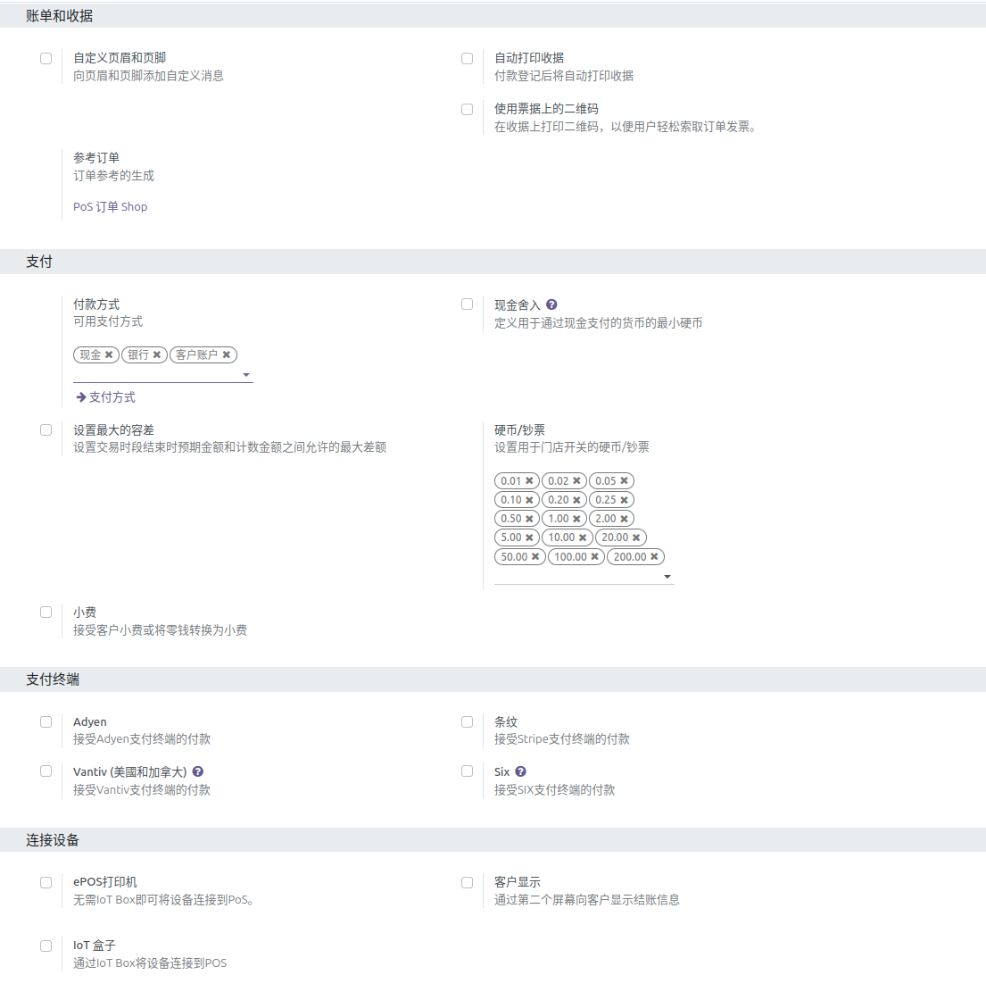

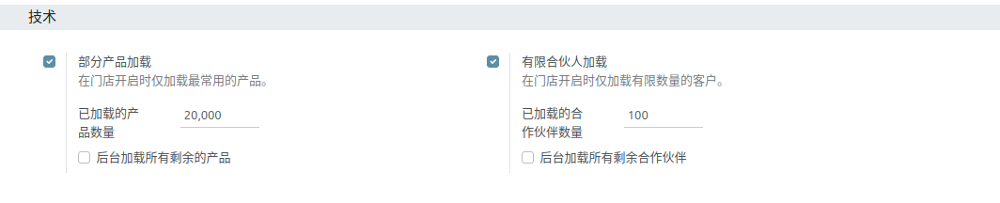

## 支付方式

点击配置-支付方式，进行支付方式设置，

路径：POS/配置/支付方式

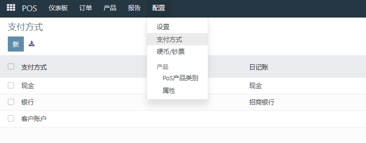

点击新建，建立新的支付方式，完成后手动保存。

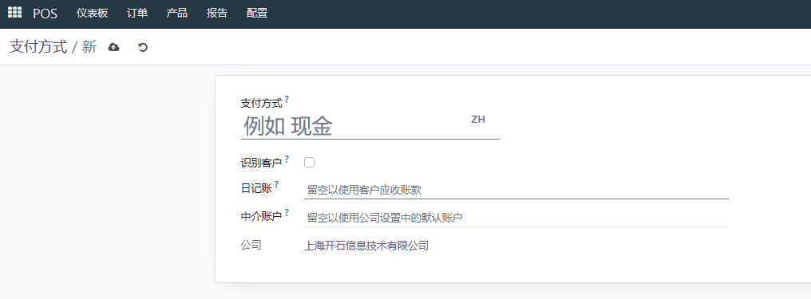

## 找零设置

进行硬币/钞票的面额设置

路径：POS/配置/硬币钞票

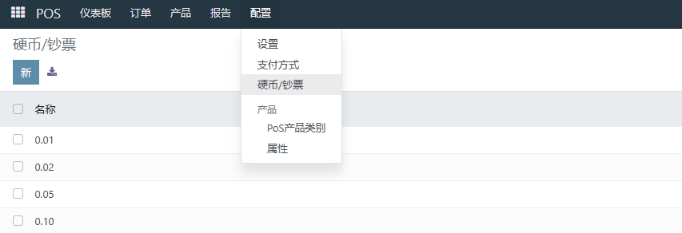

点击新建，建立新的硬币/钞票面额

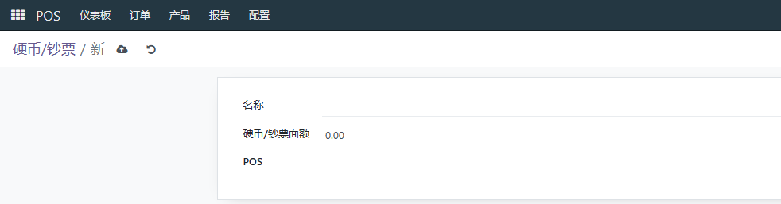

## 产品类别

进行POS产品类别设置

路径：POS/配置/POS产品类别

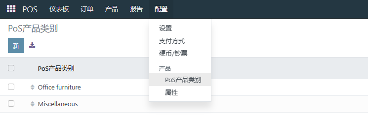

点击新建，建立pos产品类别，完成后手动保存

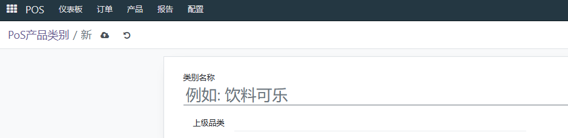

## 产品设置

置pos可用产品
路径：POS/产品/产品

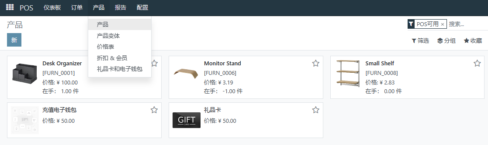

点击新建，建立产品信息，勾选销售栏pos可用，完善产品信息后，手动保存

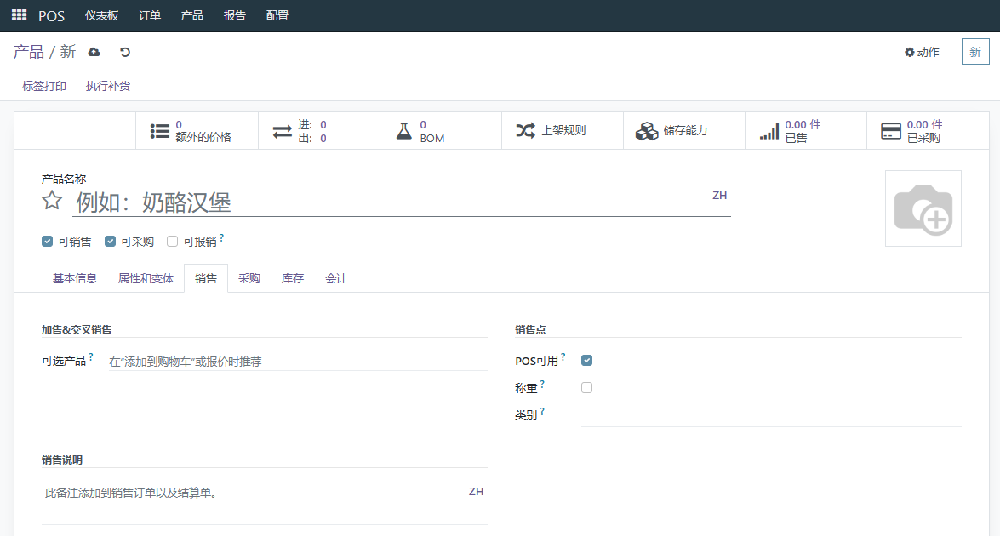

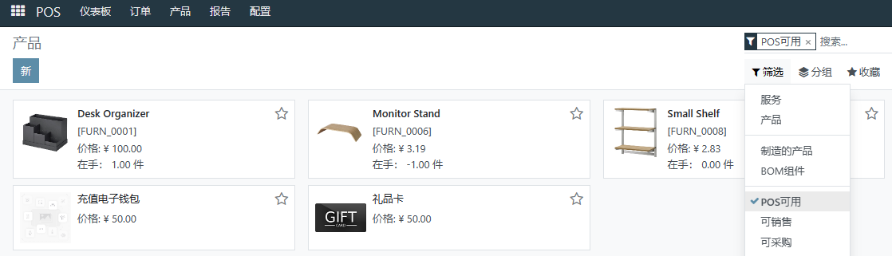