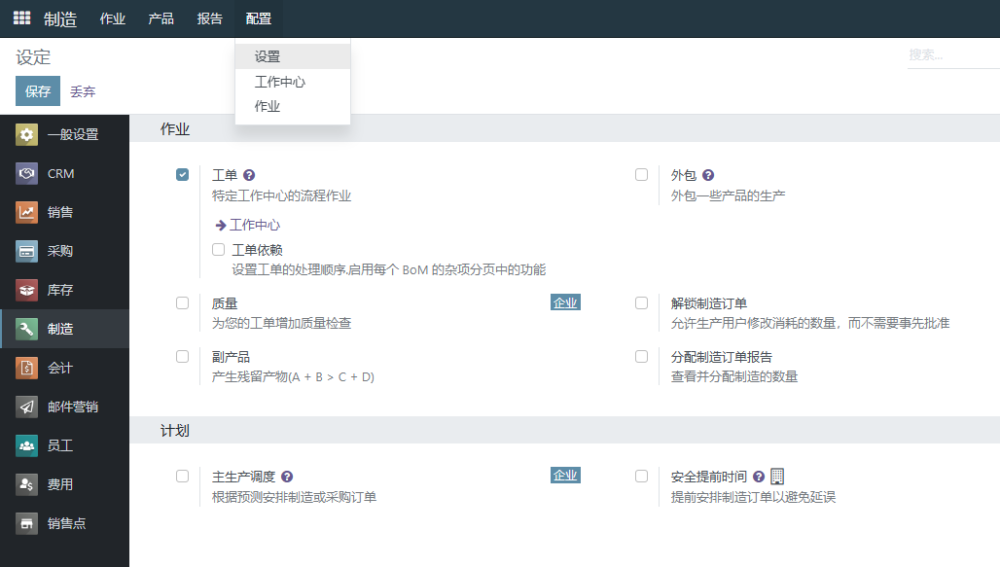
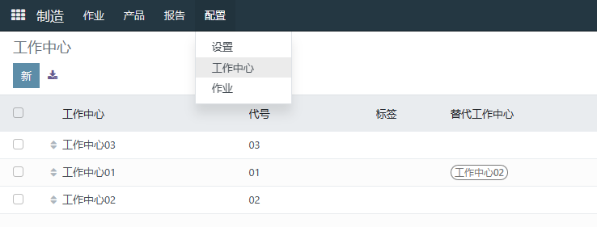
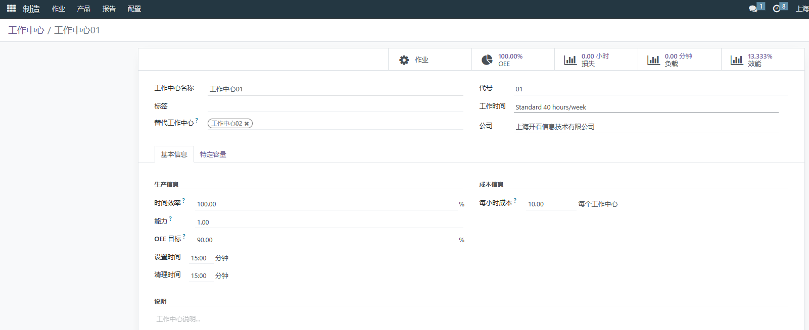
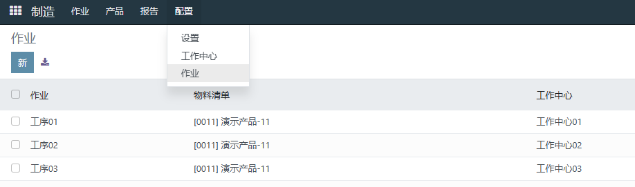
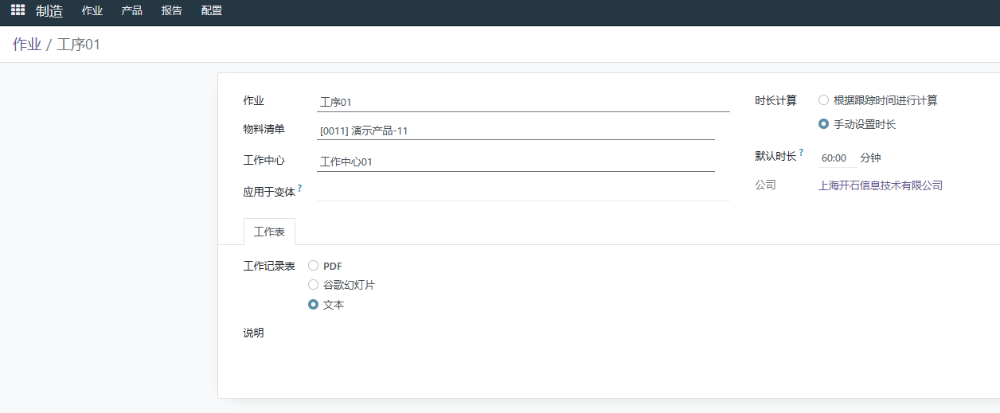
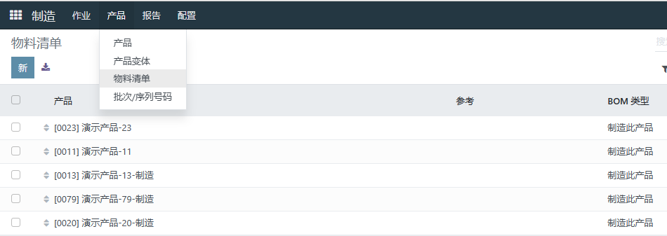
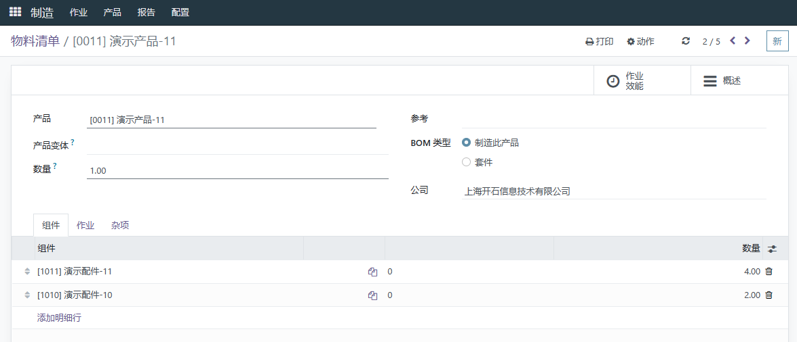
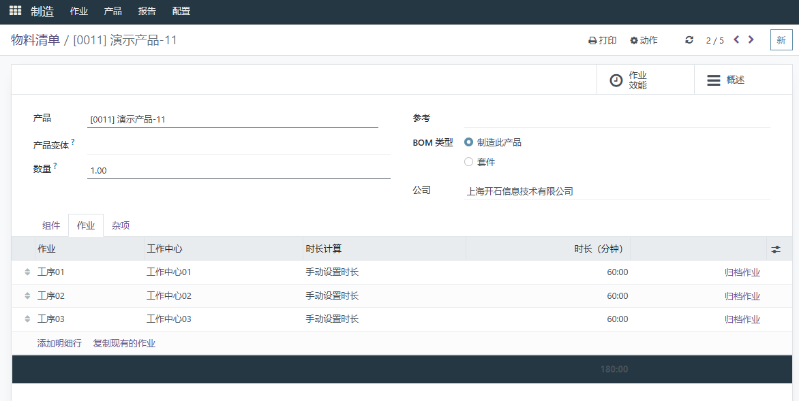
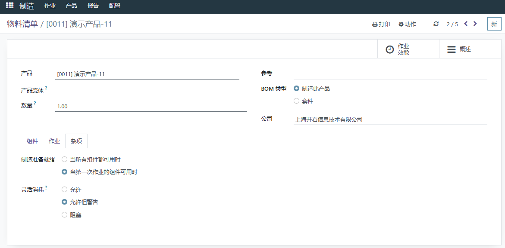

# 生产设置

::: danger
初次登录务必修改初始密码，设置10位以上包含大小写字母和数字的强安全密码，在任何情况下不要泄露给他人；同时务必保证邮箱的正确（找回密码等都需要邮箱）
:::

前提条件：已经安装 **制造** 模块

知识要求：具备基本的计算机操作知识，以及生产管理基础知识

系统权限：系统管理员 或者 生产经理

## 基础设置

点击配置，设置，进行制造模块基础设置，保存

路径：制造/配置/设置

## 工作中心

建立和查看工作中心，通常是一个有相对固定资源的生产单元

路径：制造/配置/工作中心

 

更新或者新建工作中心

点击新建，输入名称、工作时间、基本信息等。特定容量，生产某个产品的能力，保存

## 作业工序

建立和查看作业工序，由工作中心、作业名称、材料清单构成

路径：制造/配置/作业

更新或创建作业工序

点击新建，输入工序名称，选择物料清单、工作中心、时长计算等，保存

## 物料清单

建立和查看物料清单

路径：制造/产品/物料清单

更新或创建材料清单

点击新建，输入产品、数量等信息，选择产品需要的组件和数量

选择工序

选择杂项，保存
