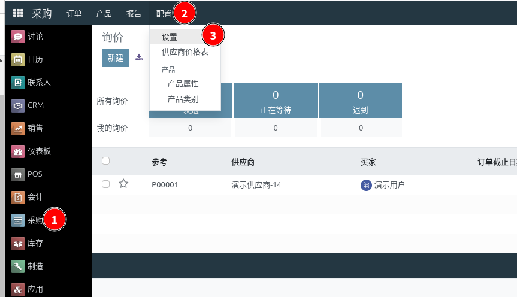
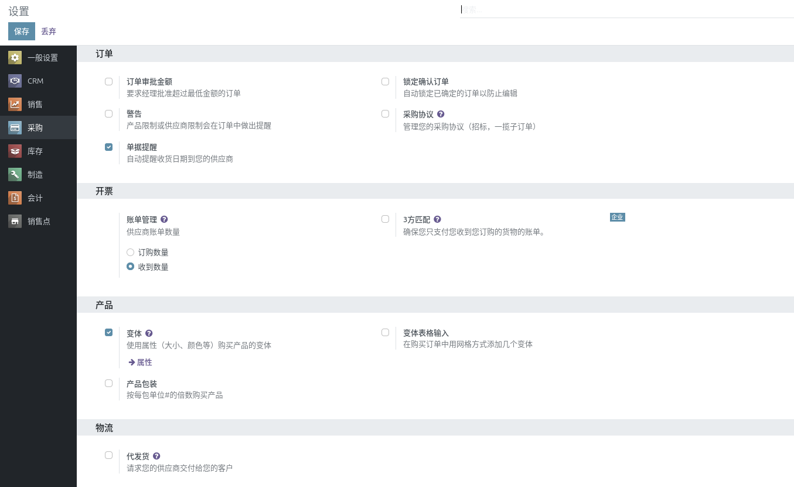
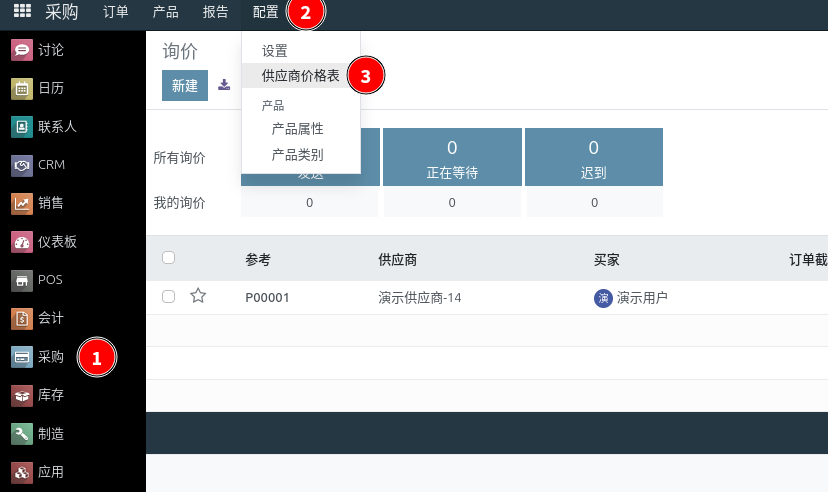
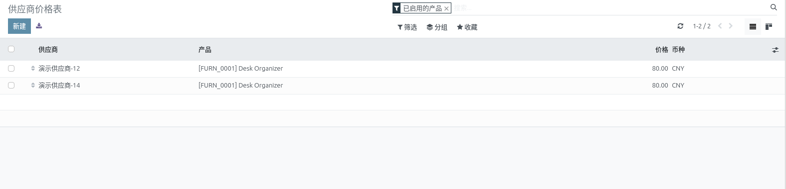
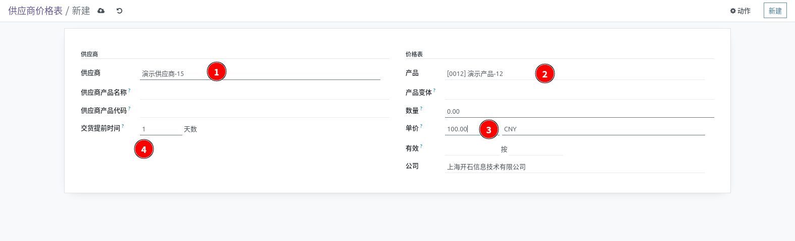
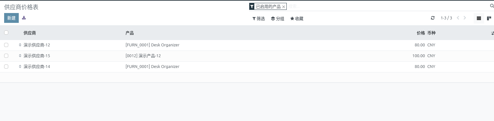

# 采购设置

::: danger
初次登录务必修改初始密码，设置10位以上包含大小写字母和数字的强安全密码，在任何情况下不要泄露给他人；同时务必保证邮箱的正确（找回密码等都需要邮箱）
:::

前提条件：已经安装 **采购** 模块

知识要求：具备基本的计算机操作知识，以及采购管理基础知识

系统权限：系统管理员 或者 采购经理

## 基础设置

点击进入基础设置页面

## 采购价格

点击进入供应商价格表

添加或者更新价格条目

选择供应商和产品，设定价格，然后保存

